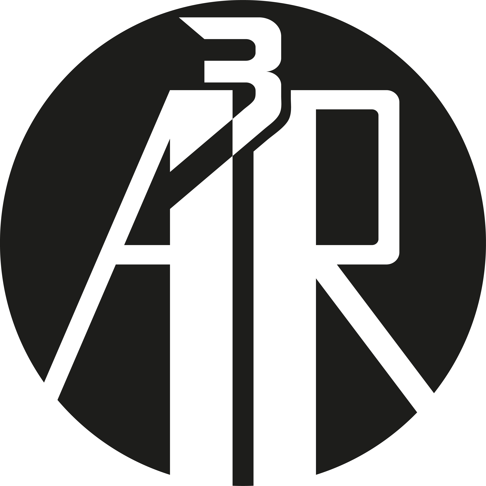

  

# Hey Everyone! 👋

---

## Who Am I? 🔍

My name is Adolfo Alejandro Arenas Ramos (**A³R**), I'm a Junior developer, student of the Francisco de Paula Santander University, and someone with a curious and artistic spirit.

## Where Am I? 🚩

I've born at the Bolivarian Republic of Venezuela.

## My Social Networks 👀

### Usually I'm more active on...

### But you can find me also on...

## My stats 🧮

  <picture>
    <source srcset="https://github-readme-stats.vercel.app/api?username=a-cubica-r&show_icons=true&theme=synthwave&&bg_color=00000000&title_color=FF0000"/>
    
  </picture>
  <picture>
    <source srcset="https://github-readme-stats.vercel.app/api/top-langs/?username=a-cubica-r&size_weight=1&count_weight=1&layout=donut"/>
    
  </picture>
  <picture>
    <source srcset="https://github-readme-stats.vercel.app/api/wakatime?username=a_cubica_r"/>
    
  </picture>

<!-- **A-cubica-R/A-cubica-R** is a ✨ _special_ ✨ repository because its `README.md` (this file) appears on your GitHub profile.

Here are some ideas to get you started:**

- 🔭 I’m currently working on ...
- 🌱 I’m currently learning ...
- 👯 I’m looking to collaborate on ...
- 🤔 I’m looking for help with ...
- 💬 Ask me about ...
- 📫 How to reach me: ...
- 😄 Pronouns: ...
- ⚡ Fun fact: ...

**A-cubica-R/A-cubica-R** is a ✨ _special_ ✨ repository because its `README.md` (this file) appears on your GitHub profile.

Here are some ideas to get you started:**

- 🔭 I’m currently working on ...
- 🌱 I’m currently learning ...
- 👯 I’m looking to collaborate on ...
- 🤔 I’m looking for help with ...
- 💬 Ask me about ...
- 📫 How to reach me: ...
- 😄 Pronouns: ...
- ⚡ Fun fact: ... -->
